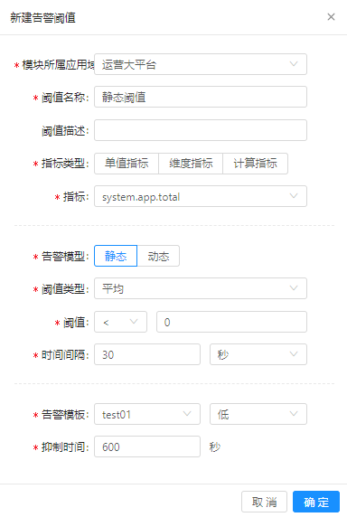
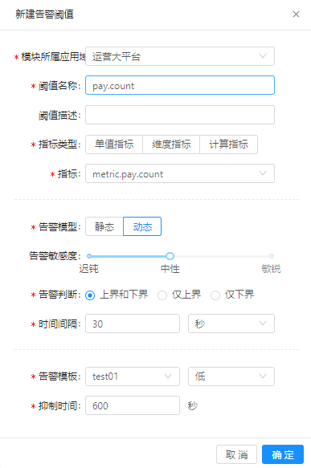

#告警阈值

每个指标都有其合理的取值范围，通过告警阈值可以实现对指标的监控，即当指标取值不在合理范围之后，会自动触发告警，从而使运维人员快速了解到系统中存在的异常。

## 前提条件 

已完成指标配置。

## 背景信息

创建告警即为某个或某组指标创建一个告警规则，并实时将根据规则计算的结果与阈值比较，在超出阈值时即触发告警：

* 告警的阈值应合理设置，否则可能会造成不必要的告警或在本应触发告警时却未上报。

* 告警包括静态和动态两种类型，静态告警以确定的阈值作为告警的触发条件，动态告警则一般是以统计量如偏差作为触发条件。

## 操作步骤

### 创建静态告警

1. 在导航树上展开“指标中心”>“告警阈值”。

2. 在“告警阈值”页面单击“新建”按钮。

3. 创建一条静态告警，如下所示：

   

4. 单击“确定”，完成创建。

### 创建动态告警

1. 在导航树上展开“指标中心”>“告警阈值”。

2. 在“告警阈值”页面单击“新建”按钮。

3. 创建一条动态告警，如下所示：

   

4. 单击“确定”，完成创建。

