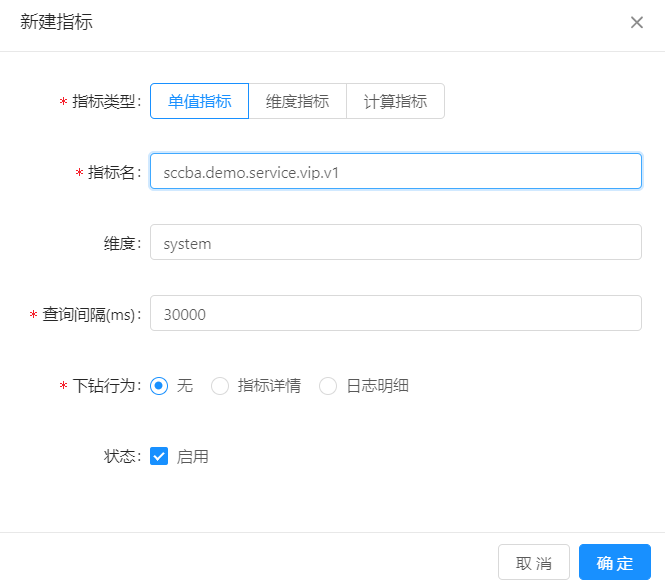
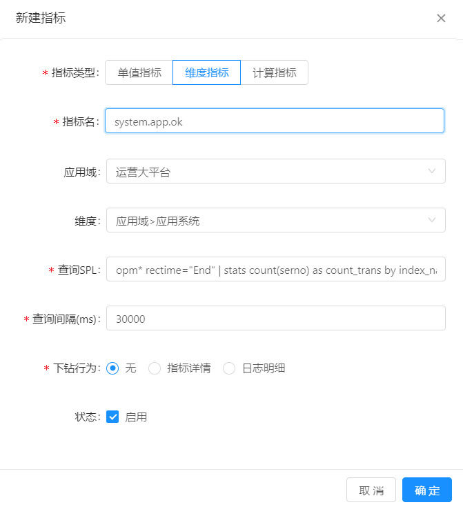
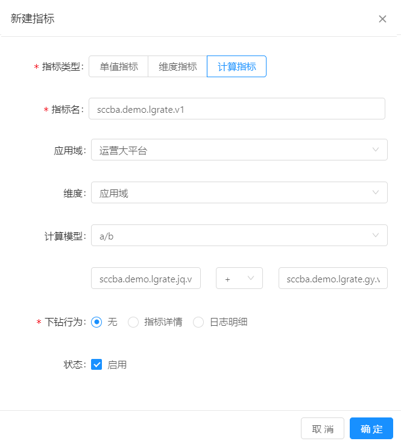

#指标配置
用户可以通过指标配置来配置监控中心的指标参数。指标配置完成后可用于告警阈值的设置。
用户可以按平台和指标名称进行查询。同时，支持添加指标、修改查询语句或公式、修改查询间隔及启用和禁用等操作。

# 指标配置

MML允许运维人员创建自定义指标，实现对业务系统运行状态的监控。

## 前提条件 

已完成数据接入配置，MML可以从业务系统中采集、解析目标日志，从而完成指标提取和存储。

## 背景信息

MML中包括三种类型的指标：

* 单值指标

  通过应用域、应用系统、应用服务、容器等标签定义，可以在拓扑监控页面查询。

* 维度指标

  通过SPL定义和基于Flink的实时计算引擎产生，可以在指标定制监控页面查询。

* 计算指标

  通过对已有的实时计算指标或采集指标进行计算获得。

## 操作步骤

### 创建单值指标

1. 在导航树上展开“指标中心”>“指标配置”。

2. 在“指标配置”页面单击“新建”按钮。

3. 创建单值指标，示例如下所示：

   
   
4. 单击“确定”，完成创建。

### 创建维度指标

1. 在导航树上展开“指标中心”>“指标配置”。

2. 在“指标配置”页面单击“新建”按钮。

3. 创建维度指标，示例如下所示：

   
   
4. 单击“确定”，完成创建。

### 创建计算指标

1. 在导航树上展开“指标中心”>“指标配置”。

2. 在“指标配置”页面单击“新建”按钮。

3. 创建计算指标，示例如下所示：

   
   
4. 单击“确定”，完成创建。

## 后续操作

指标具有“启用”和“禁用”两种状态，在启用状态下，MML会进行指标的采集，需要消耗一定的计算计算；在禁用状态下，MML会暂停对该指标相关数据的采集和运算，停止不用的指标可以节省系统资源。

   

