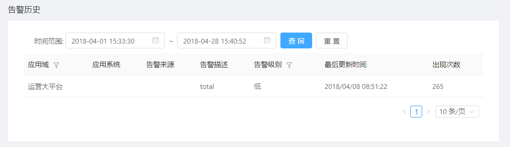

#告警历史

告警历史记录了系统中已发生的告警，便于运维人员进行分析。

## 前提条件 

已完成告警阈值的配置。

## 背景信息

所有在系统中发生的告警都会被记录，运维人员可以通过时间范围进行告警的过滤，并可以将筛选出的告警按应用域或告警级别继续排序。

## 操作步骤

1. 在导航树上展开“指标中心”>“告警历史”。

2. (可选)在“告警历史”页面设置查询的时间范围。

3. 单击“查询”按钮。

   查询出的结果列表如下所示：
   
   

   