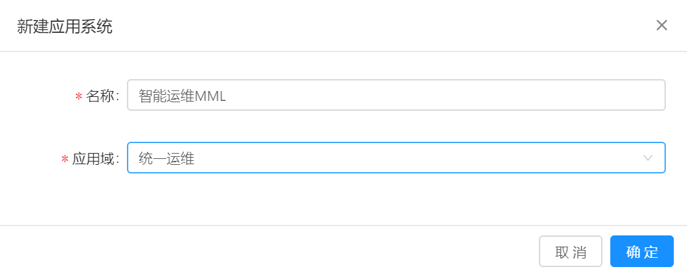

# 应用架构

应用架构指构成系统的各级组件以及组件之间的相互关系。

## 前提条件

MML系统可正常运行并且可以和应用系统正常通信。

## 背景信息

应用架构时构建应用拓扑的基础，只有将应用系统先在MML中映射为应用架构，然后才能通过拓扑反应实际的应用集成关系。相关概念如下所示：

* 应用域：表示完全独立的系统。
* 应用系统：应用域下的相对独立的子系统。
* 应用服务：每个应用服务对应一种服务类型，每种应用服务类型都具有预先定义好的配置和指标。
* 服务实例：服务实例表示在服务器上运行的一个程序或应用。
* 机器：表示一台真实的服务器以及该服务器上部署的各类服务实例。

## 操作步骤

### 创建应用域

1. 在导航树上展开“拓扑分析”>“应用架构”。

2. 在“应用架构”页面单击选项卡“应用域”。

3. 单击应用域列表上方的“新建”按钮，创建新的应用域，如下图所示：

   
   
4. 单击“确定”完成应用域的创建。

### 创建应用系统

1. 在导航树上展开“拓扑分析”>“应用架构”。

2. 在“应用架构”页面单击选项卡“应用系统”。

3. 单击应用系统列表上方的“新建”按钮，创建新的应用系统，如下图所示：

   
   
4. 单击“确定”完成应用系统的创建。

