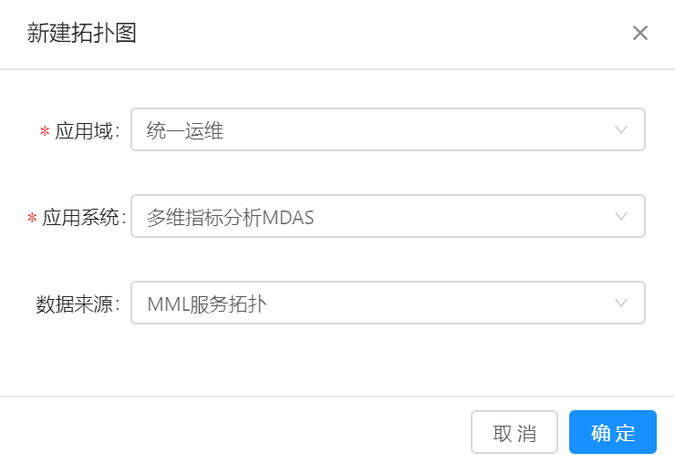
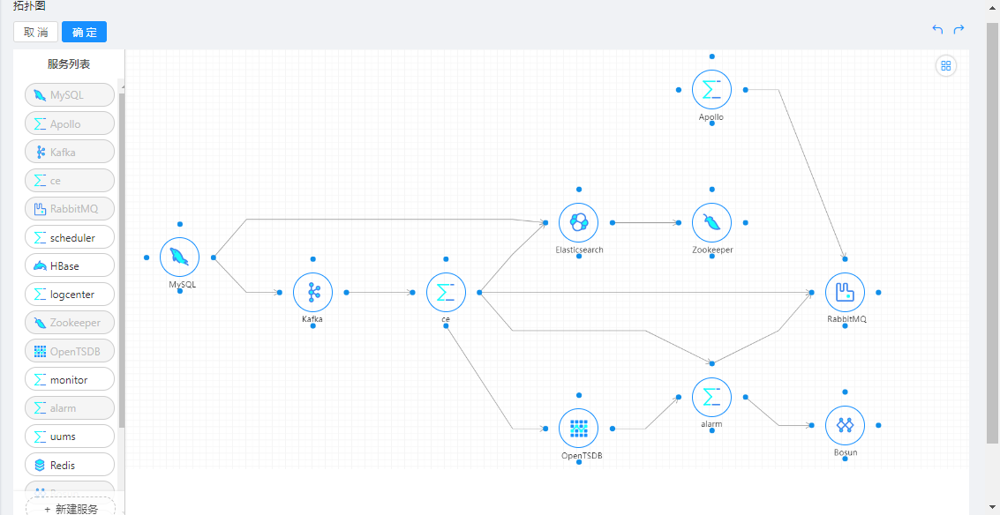

# 拓扑图

拓扑图是一个系统范围内的应用服务之间关系的图形化表示。

## 前提条件

已在系统中完成应用服务的创建。

## 背景信息

应用拓扑由节点和边线组成，其中节点表示应用服务，边线表示应用服务之间的关联关系。

通过应用服务可以了解该服务的运行实例、部署位置等信息。

应用服务之间的关联关系有三种：

- 通信关联 
  
  服务间的相关通信关系，如socket，共享内存，消息，管道等。

- 数据关联
  
  服务间通过数据发生的关系，数据生产端产生数据，通过push或者pull发生提供给消费端使用。

- 任务关联
  
  任务之间前后触发或依赖形成的任务流关系。
  

## 操作步骤

1. 在导航树上展开“拓扑分析”>“拓扑图”。

2. 在“拓扑图”页面单击“新建拓扑”，创建新的拓扑图，如下图所示：

   
   
   依次选择“应用域”、“应用系统”、“数据来源”。
   
3. 单击“确定”，系统显示拓扑图编辑页面。

4. 编辑拓扑图。

   - 在拓扑图编辑页面左侧是服务列表，您可以通过拖拽的方式将其移动到右侧画布中。
   - 在拓扑图编辑页面右侧为拓扑图，您可以在其中为应用创建拓扑关系。
   
   在拓扑图中支持如下编辑方式：
   - 连接图元：
     
     在一个图元的一个连接点上按住鼠标左键，并将光标移动到目标图元的一个连接点上，然后再放开鼠标即可将两个图元进行连接。
     
   - 连接类型：
   
     鼠标左键单击一条连接线，单击可以修改连接类型，单击可以删除连接线。
     
     一个已创建的拓扑图如下所示：
     
     
5. 单击“确定”完成拓扑图的创建。     

 
  
   

