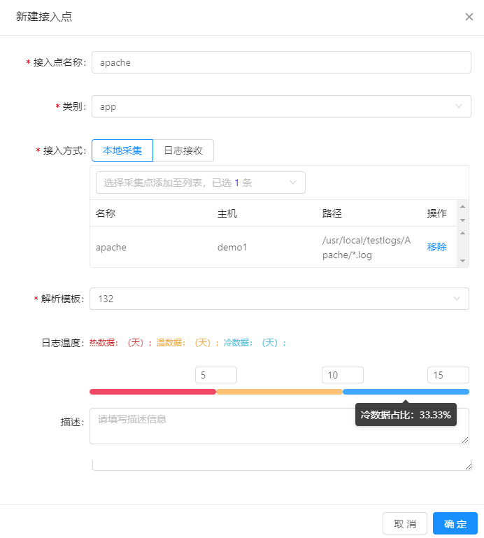

# 数据接入

MML智能运维管理系统由日志采集器和日志服务器组成，在进行日志采集前需要将部署在业务服务器的日志采集器添加到系统中并进行相关配置。

## 前提条件

* 已完成日志采集点的配置。

* 已完成日志接收点的配置。

* 已完成日志类型的配置。

* 已完成日志解析模板的配置。

## 背景信息

数据接入是实现日志采集的必要过程，对于业务侧要采集的日志都需要配置相应的数据接入实例。通过数据接入的配置，MML才可以实现对具体日志的采集与解析过程。

**日志采集：**

MML中的日志采集方式如下所示：

* 主动采集方式：需要在业务侧服务器部署Logstash插件，用于完成日志的采集。

* 被动接收方式：无序在业务侧服务器部署插件，由业务侧服务器自主实现日志推送，MML只需要配置并启用日志接收实例即可。

**日志解析**

MML通过Logstash实现日志解析，解析方法则通过解析模板指定。

## 操作步骤

1. 在导航树上展开“数据集成”>“数据接入”。

2. 在“数据接入”页面的右上角单击“新建”按钮。

3. 在“新建接入点”对话框中完成接入点的配置，如下所示：

   
   
   配置参数说明如下所示：
   
   * 接入点名称：用于标识一个接入点。
   * 类别：可根据日志类型进行配置。类别需要在“数据集成”>“接入配置”中进行预先配置。
   * 接入方式：
      * 本地采集：即通过部署在业务服务器的Logstash插件主动采集日志并发送到MML系统中。该种方式下需要在配置中指定采集点。采集点需要在“数据集成”>“接入配置”中进行预先配置。
      * 日志接收：即业务侧服务器主动推送日志，只需要在指定接收点即可。接收点需要在“数据集成”>“接入配置”中进行预先配置。
   * 解析模板：被采集的原始日志一般为长文本形式，解析模板即用于指定如何从原始日志文本中提取需要的各个字段值。
   *日志温度：日志在MML系统中有多种保存方式，如可以保存在ElasticSearch中进行快速检索，也可以保存在HDFS中进行长期大容量存储。通过日志温度可以设置日志在各类存储服务中保存的时长。其中热数据提供最快的查询服务，但存储成本较高，冷数据提供大容量存储，但查询延时较高，而温数据则介于二者之间。可以根据实际需要配置日志的在各类存储服务中的保存时长。
   * 描述：介绍该数据接入的作用等信息。
   
4. 单击“确定”完成配置。

## 后续操作

对于已创建的“数据接入”，可以在“数据接入”页面的列表中对其执行查看、编辑或删除操作。

