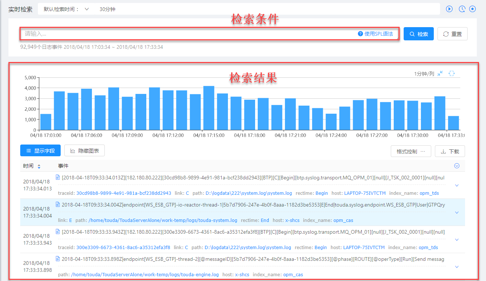

# 实时检索

您可以通过SPL语法进行日志实时检索。

## 前提条件 

已完成数据接入配置，MML可以从业务系统中采集、解析目标日志，并存储解析结果。

## 背景信息

MML实时的从业务系统中采集日志，并将解析结果保存在ElasticSearch中。日志的实时检索即是根据用户的搜索条件从ElasticSearch中提取目标结果。

## 操作步骤

1. 在导航树上展开“数据集成”>“实时检索”。

   系统显示实时检索页面，如下所示：
   

2. 输入查询条件进行检索。
   
   查询条件需要满足SPL语法，语法规则请单击检索框右侧的“使用SPL语法”获取。
   
   输入查询语句后，可以单击输入框左侧的将其添加到收藏夹中，从而再次查询时可以直接从收藏夹中选择该语句。
   
3. (可选)实时检索。

   检索可以对历史日志进行查询，当需要实时更新查询结果时，可以单击页面右上角的启用实时检索功能。
   
   实时检索功能默认查询30分钟以内的日志，且每隔30秒刷新一次查询结果。
   
   - 通过单击“默认检索时间”，在下拉框中可以设置实时检索的时间范围。
   
   - 通过单击页面右上角的可以停止实时查询。
