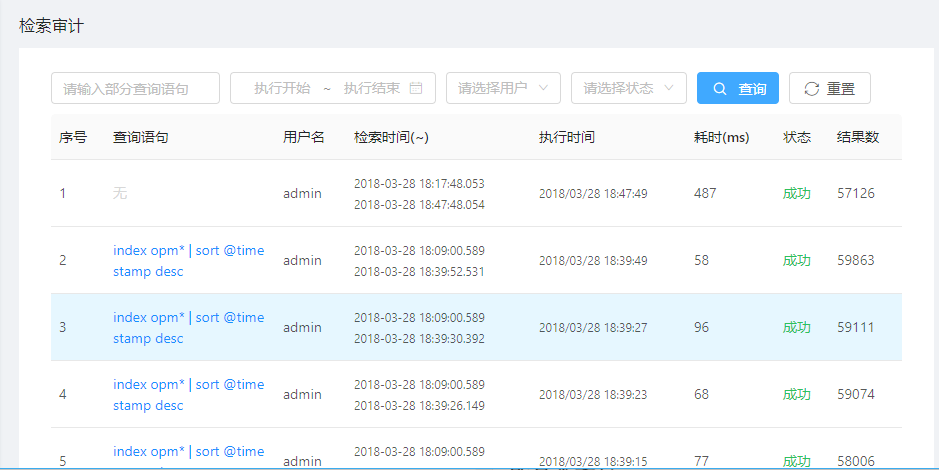

# 检索审计

检索审计记录了所有用户在MML系统中的日志查询记录。

## 前提条件

系统中已经产生了日志查询记录。

## 背景信息

日志中记录了业务系统运行中的关键信息，因此日志查询应该被合理的控制，避免泄露造成不必要的信息泄露。检索审计则记录了MML系统中的日志查询历史，管理员可以通过该功能及时发现系统中可能存在的安全风险并进行规避。

## 操作步骤

1. 在导航树上展开“数据集成”>“检索审计”。

2. 进行查询记录检索。

   MML系统提供了多种检索记录过滤条件，如可以指定部分查询语句、指定查询范围、指定查询用户以及指定查询结果状态等，如果不指定任何查询记录，则可以获取所有历史查询记录。
   
   
   
   
## 后续操作

通过“重置”可以清除所有查询条件。

