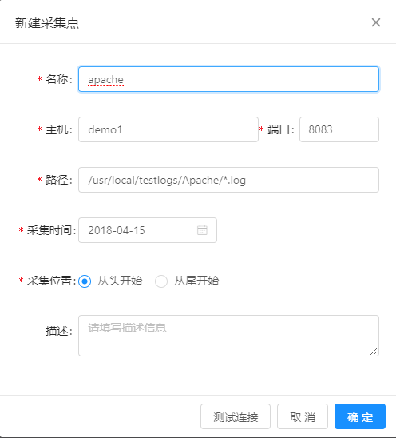
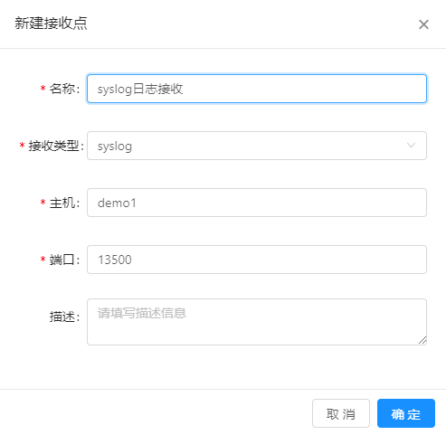
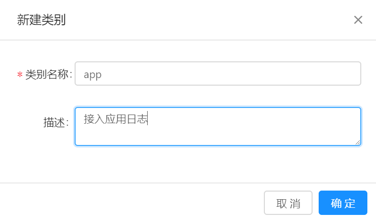

# 接入配置

要将业务系统生成的日志转换为可以检索的日志，需要经过多个采集、解析等步骤的处理。通过接入配置可以实现这些处理步骤的管理。

## 前提条件

* 已确认日志采集方式。
* 已获取被采集日志的路径、日志格式等信息。

## 背景信息

接入配置包括包括如下几项：

* 采集点：即部署在业务服务器侧的Logstash，该Logstash用于采集其所在服务器上指定目录下的日志。
* 接收点：对于主动推送方式，需要在MML系统中启动一个接收进程，用于接收业务系统主动推送的日志。
* 接入类别：用于日志分类，可以根据实际情况定义。
* 解析模板：实现日志解析，每种类型的日志都需要为其配置一个解析模板。解析模板使用正则表达式对原始日志文本进行处理，提取日志中的有用信息。
* 日志解析器：部署在MML系统中的Logstash，也称为后置Logstash。它根据解析模板进行日志解析。

## 操作步骤

### 配置采集点

1. 在导航树上展开“数据集成”>“接入配置”。

2. 在“接入配置”页面单击采集点列表上方的“新建”按钮。

3. 在“新建采集点”对话框中完成配置，如下所示：

   
   
   配置参数说明如下所示：
   * 名称：采集点名称，可以根据实际情况定义。
   * 主机：安装前置Logstash的主机名或IP地址。
   * 端口：前置Logstash监听的端口号。
   * 路径：被采集日志的绝对路径。
   * 采集时间：只有设定的采集时间之后的日志才会被采集。
   * 采集位置：表示从日志文件头或日志文件尾开始采集日志。
   * 描述：介绍该采集点的作用等信息。
   
4. 单击“新建采集点”对话框下方的“测试连接”按钮，检查系统和已配置的前置Logstash之间是否可以正常通信。
   
5. 测试连接可用后，单击“确定”完成配置。

### 配置接收点

1. 在导航树上展开“数据集成”>“接入配置”。

2. 在“接入配置”页面的右上角单击“接收点”页签名。

3. 在“接入配置”页面单击接收点列表上方的“新建”按钮。

   

   配置参数说明如下所示：
   * 名称：接收点名称，可以根据实际情况定义。
   * 接收类型：表示不同的接收方式。
   * 主机：安装后置Logstash的主机名或IP地址。
   * 端口：后置Logstash监听的端口号。
   * 描述：介绍接收点的作用等信息。

4. 单击“确定”按钮完成配置。

### 配置接入类别

1. 在导航树上展开“数据集成”>“接入配置”。

2. 在“接入配置”页面的右上角单击“接入类别”页签名。

3. 在“接入配置”页面单击接入类别列表上方的“新建”按钮。
   
   

   配置参数说明如下所示：
   * 类别名称：可以根据实际情况定义。
   * 描述：介绍接入类别的作用等信息。

4. 单击“确定”按钮完成配置。

### 配置解析模板

1. 在导航树上展开“数据集成”>“接入配置”。

2. 在“接入配置”页面的右上角单击“解析模板”页签名。

3. 在“接入配置”页面单击解析模板列表上方的“新建”按钮。
   
   

   配置参数说明如下所示：
   * 类别名称：可以根据实际情况定义。
   * 描述：介绍接入类别的作用等信息。

4. 单击“确定”按钮完成配置。

 
### 配置日志解析器 

# 后续步骤
对于已创建的“数据接入”，可以在“数据接入”页面的列表中对其执行查看、编辑或删除操作。

