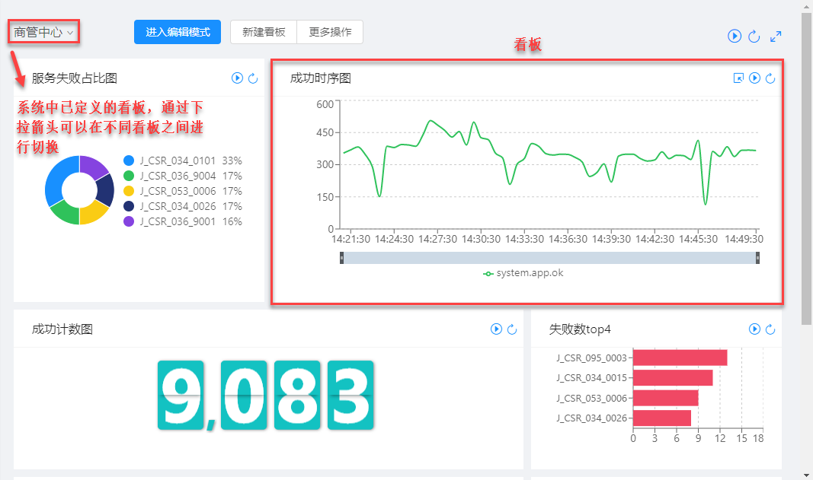
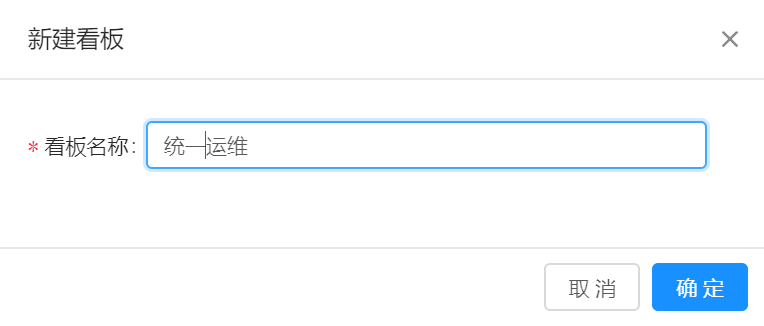
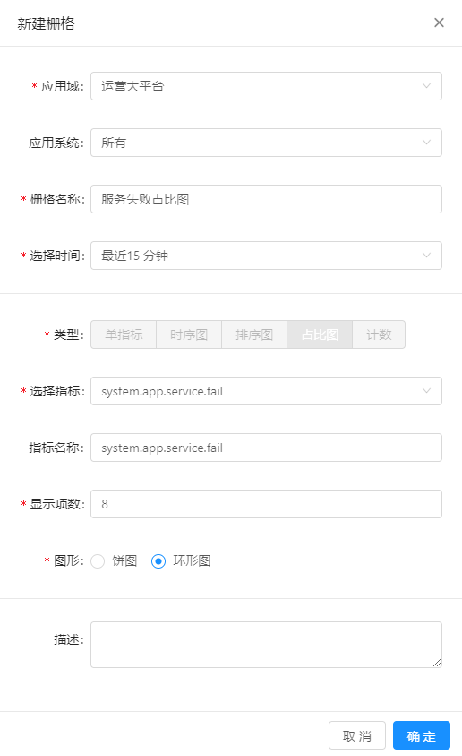

# 监控配置

监控配置用于实现个性化的指标监控展示。

## 前提条件 

已完成数据接入配置，MML可以从业务系统中采集、解析目标日志，并存储解析结果。

## 背景信息

看板是用于展示监控指标的一个页面，在一个看板上可以添加一个或多个栅格。将栅格与某个监控指标关联，则该栅格可以对该指标的变化进行图形化展示，并且可以提供该指标的实时监控功能。

## 操作步骤

1. 在导航树上展开“监控配置”>“监控配置”。

   系统显示已定义的指标监控看板，如下所示：
   
   
   
   * 通过页面左上角的下拉箭头，可以在已配置的不同看板之间进行切换并将其中之一设置为默认展示看板。
   
   * 看板由栅格组成，在编辑模式下，可以在看板中增加或删除其中的栅格。
   
   * 栅格中的监控图默认是静态的，通过栅格右上角的按钮可以开启实时监控，通过栅格右上角的按钮则可以刷新展示结果。

2. 新建看板。

   在“监控配置”页面顶端选择“新建看板”>“添加看板”。
   
   在对话框中输入新建看板的名称，并单击“确定”按钮，如下图所示：
      
   
      
3. 在新建的空白看板中添加栅格。
   
   新创建的看板默认为空，运维人员可以根据自己的需要向其中添加栅格。
   
   1. 单击页面顶端的“新建删除”按钮，系统弹出“新建栅格”对话框。
   
   2. 在“新建栅格”对话框中配置要监控的指标，如下图所示：
   
      
      
      * 应用域：业务系统的一级分类，请根据实际情况从下拉框中选择。
      
      * 应用系统：系统以索引的形式表示业务系统，请根据实际情况从下拉框中选择。
      
      * 栅格名称：在看板上该栅格的名称，请根据实际情况定义。
      
      * 选择时间：指点栅格展示的指标的时间范围，请根据实际情况选择。
      
      * 类型：栅格中图示的类型，不同类型的指标添加方式会有所不同。如下以单指标为例进行说明：
      
         - 选择指标：从下拉框中选择您需要监控的指标。
         
         - 指标名称：可以由用户自定义。
         
         - 图形：选择指标的图形化展示方式。
         
         - 选择颜色：选择栅格中监控图的颜色。
          
      * 描述：添加栅格的备注信息，方便其它运维人员迅速了解该栅格的创建原因等。 
      
   3. 单击“确定”按钮，完成栅格创建。
   
   4. （可选）重复上述步骤，为看板添加其它的栅格。
   
4. 单击页面顶端的“保存”按钮，可以保存已完成的看板配置。

5. 单击发布按钮，可以退出编辑模式。

      
      
      

   
   
   
      
   
   
   
   

      

